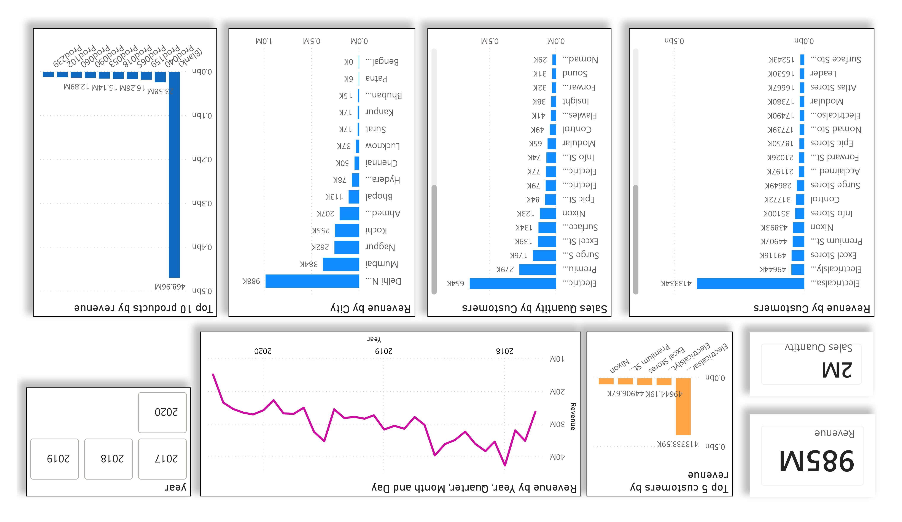
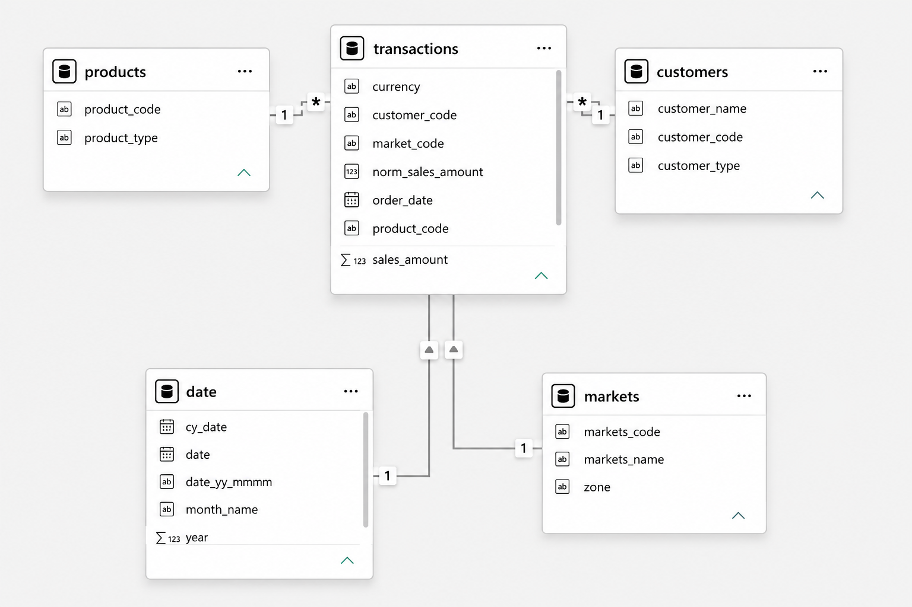

# 📊 Sales Analytics Dashboard

An end-to-end **Business Intelligence Dashboard** built using **Power BI** and **MySQL** to analyze sales performance and generate actionable business insights through interactive visualizations and KPI-driven reports.

---

## 📷 Dashboard Preview

### Sales Dashboard

<p align="center">
  
</p>

### Data Model (Schema)

<p align="center">
  
</p>

---

## 🚀 Features

- 📈 Interactive Sales Dashboard
- 💰 Revenue & Sales Quantity KPIs
- 👥 Customer-wise Revenue Analysis
- 🏙️ City-wise Revenue Distribution
- 🛍️ Top Products by Revenue
- ⭐ Top Customers by Revenue
- 📅 Revenue Trend Analysis (Year → Quarter → Month → Day)
- 🎛️ Interactive Filters & Drill-down Reports
- ⚡ Automated ETL using Power Query
- 📊 DAX Measures for Business KPIs

---

## 🛠️ Tech Stack

- **Power BI Desktop**
- **MySQL**
- **SQL**
- **Power Query**
- **DAX**
- **Data Modeling**
- **Business Intelligence**

---

## 📁 Repository Structure

```text
SALES/
│
├── dataset/
│   ├── db_dump.sql
│   └── README.md
│
├── SQL/
│   ├── sales_customers.sql
│   ├── sales_date.sql
│   ├── sales_markets.sql
│   ├── sales_products.sql
│   └── sales_transactions.sql
│
├── Dump20260628.sql
├── Readme.md
├── Sales_Dashboard.pbix
├── Sales_Dashboard.pdf
├── Sales_Dashboard_Image.jpg
└── Schema.png
```

---

## 📊 Dashboard Overview

This dashboard provides interactive business insights through multiple visualizations.

### Key KPIs

| Metric | Value |
|---------|------:|
| **Revenue** | **985M** |
| **Sales Quantity** | **2M** |

### Dashboard Insights

- Revenue by Customers
- Sales Quantity by Customers
- Revenue by City
- Top 5 Customers by Revenue
- Top 10 Products by Revenue
- Revenue Trend Analysis
- Interactive Slicers & Filters
- Executive KPI Cards

---

## 🗄️ Database

The project uses a MySQL database consisting of the following tables:

- Customers
- Products
- Markets
- Transactions
- Date

Individual SQL scripts are available inside the **SQL/** directory.

---

## 📂 Files

| File | Description |
|------|-------------|
| **Sales_Dashboard.pbix** | Power BI dashboard source file |
| **Sales_Dashboard.pdf** | Exported dashboard report |
| **Sales_Dashboard_Image.jpg** | Dashboard preview |
| **Schema.png** | Data model relationship diagram |
| **Dump20260628.sql** | Complete MySQL database dump |
| **dataset/db_dump.sql** | Database backup |
| **SQL/** | Individual SQL scripts for each table |

---

## 📈 Business Insights

The dashboard enables users to:

- Monitor overall sales performance
- Analyze customer purchasing behavior
- Identify top-performing products
- Compare revenue across different cities
- Track revenue trends over time
- Support data-driven business decisions

---

## ⚙️ Getting Started

### Clone the repository

```bash
git clone https://github.com/OmUmale19/Sales-Analytics-Dashboard.git
```

### Import the database

Use either:

- `Dump20260628.sql` (Complete Database)

or

- Individual SQL files inside the **SQL/** folder.

### Open the Dashboard

Open **Sales_Dashboard.pbix** in **Power BI Desktop**, update the MySQL data source if needed, and click **Refresh**.

---

## 🎯 Resume Highlights

- Developed an end-to-end Business Intelligence dashboard in **Power BI** integrated with **MySQL**, transforming raw sales data into interactive visualizations for revenue, profit, order volume, and customer analytics.
- Engineered efficient **Power Query ETL workflows** and **DAX measures** to automate data cleaning, KPI computation, monthly sales analysis, and category-wise performance tracking, reducing manual reporting effort by **~90%**.
- Designed executive-level dashboards featuring KPI cards, drill-down capabilities, interactive slicers, and trend analysis to improve business reporting efficiency by **~80%**.

---

## 👨‍💻 Author

**Om Umale**

- GitHub: https://github.com/OmUmale19
- LinkedIn: https://www.linkedin.com/in/om-umale-2648a4253/
- Portfolio: https://portfolio-delta-gilt-64.vercel.app/

---

⭐ If you found this project useful, consider giving it a **Star**!